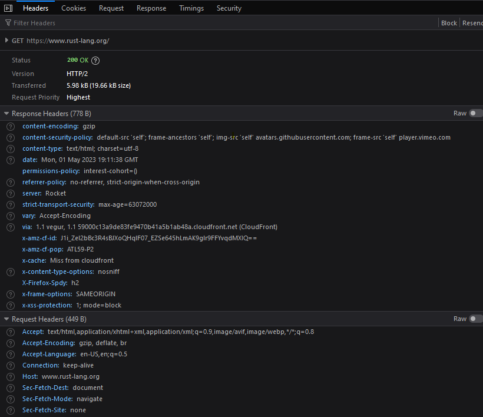

# Correspondence Between What You See in Browser, Dev Tools, and Methods inside Reqwest

## URL

    https://www.rust-lang.org

## Browser

    Provides the web page

## Dev Tools

    

## Reqwest Methods:

    .text() gives HTML as a well formatted String

## URL

## Browser

## Dev Tools

## Reqwest Methods:

---

## URL

## Browser

## Dev Tools

## Reqwest Methods:

---

## URL

## Browser

## Dev Tools

## Reqwest Methods:

---

## URL

## Browser

## Dev Tools

## Reqwest Methods:
